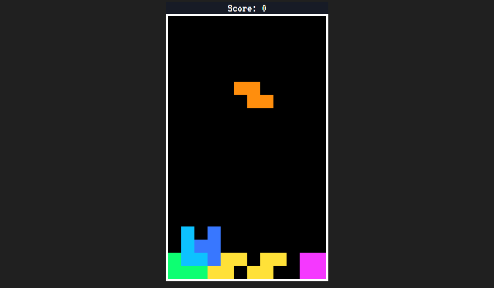

# Game Tetris

<h3>Sobre o jogo:</h3>

Tetris é um famoso jogo eletrônico do gênero quebra-cabeça criado por Alexey Pajitnov, lançado em junho de 1984. Pajitnoy era engenheiro de informática no Centro de Computadores da Academia Russa das Ciências. O jogo consiste em empilhar "tetraminós" que descem a tela de forma que completem linhas horizontais. Quando uma linha se forma, ela se desintegra, as camadas superiores descem, e o jogador ganha pontos. Quando a pilha de peças chega ao topo da tela, a partida se encerra. (Fonte: Wikipédia)

<h3>Como jogar:</h3>

Utilize as setas de direção para mover as peças, use as teclas [Q] e [W] para rotacionar as peças.

<h3>Informações:</h3>

Pojeto desenvolvido utilizando apenas HTML, CSS e JavaScript

